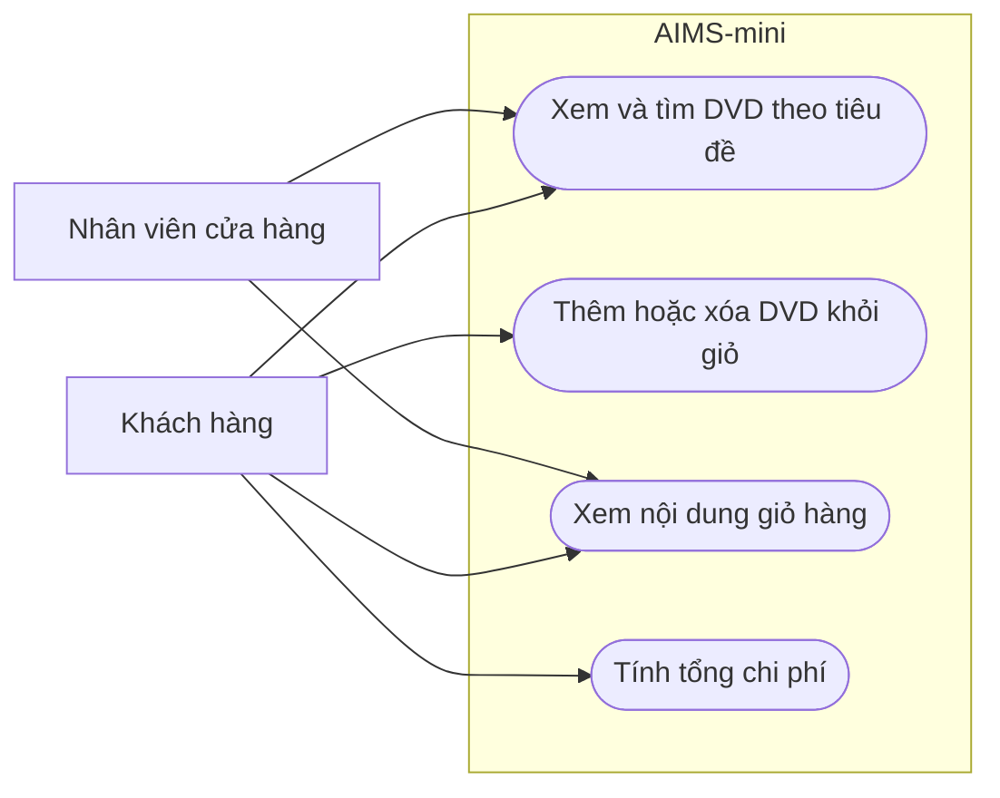

# AIMS-mini – Use case

```mermaid
flowchart LR
    customer[Khách hàng]
    clerk[Nhân viên cửa hàng]

    subgraph aims[AIMS-mini]
        browse([Xem và tìm DVD theo tiêu đề])
        cart([Thêm hoặc xóa DVD khỏi giỏ])
        inspect([Xem nội dung giỏ hàng])
        total([Tính tổng chi phí])
    end

    customer --> browse
    customer --> cart
    customer --> inspect
    customer --> total
    clerk --> browse
    clerk --> inspect
```

Khách hàng có thể tìm đĩa theo tiêu đề, quản lý giỏ hàng, xem các đĩa
đang chọn và kiểm tra tổng chi phí. Nhân viên có thể tra cứu DVD và hỗ
trợ kiểm tra nội dung giỏ.
